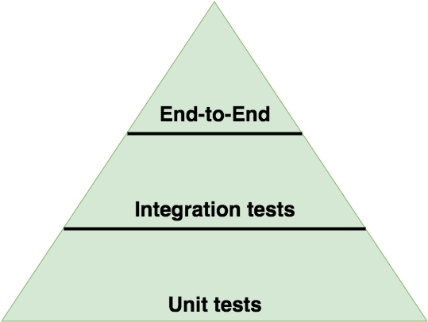
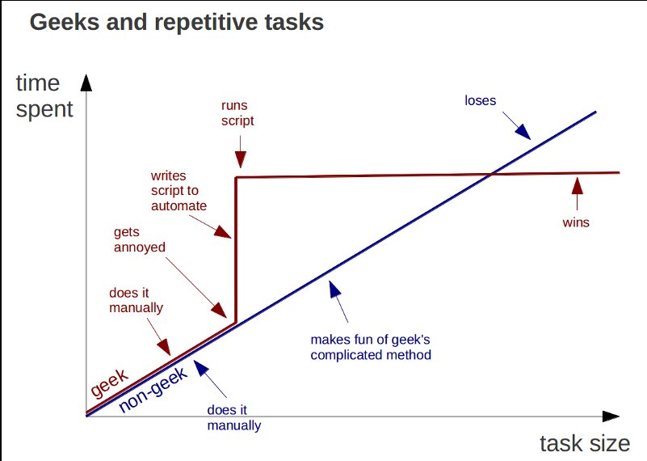
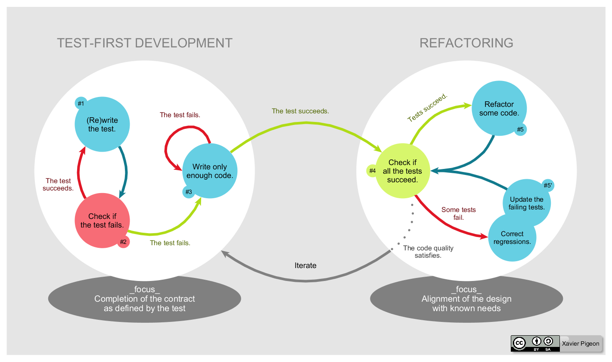
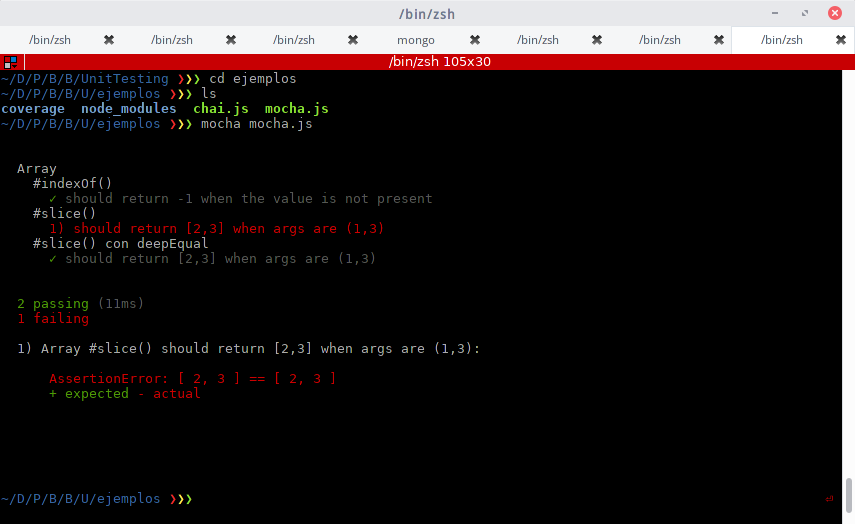
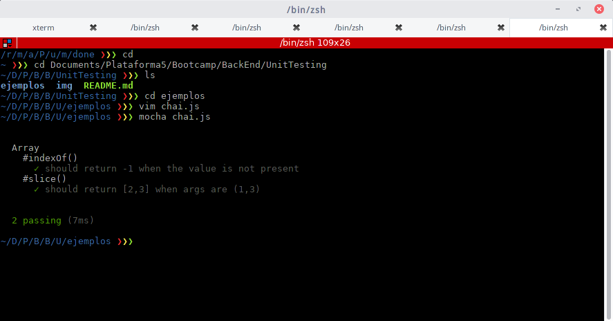
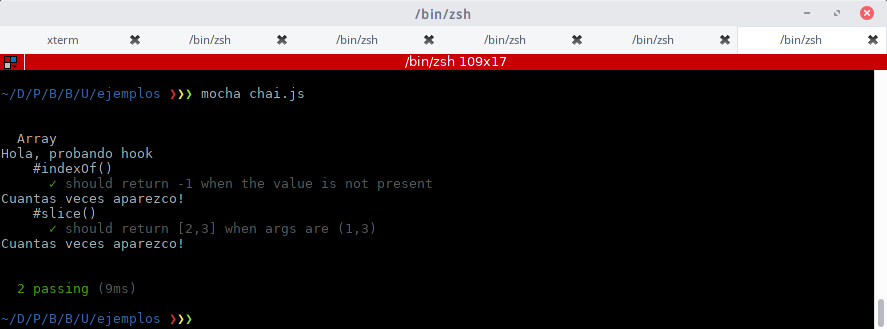
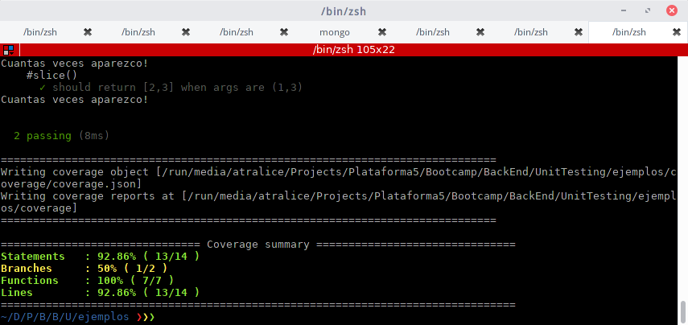
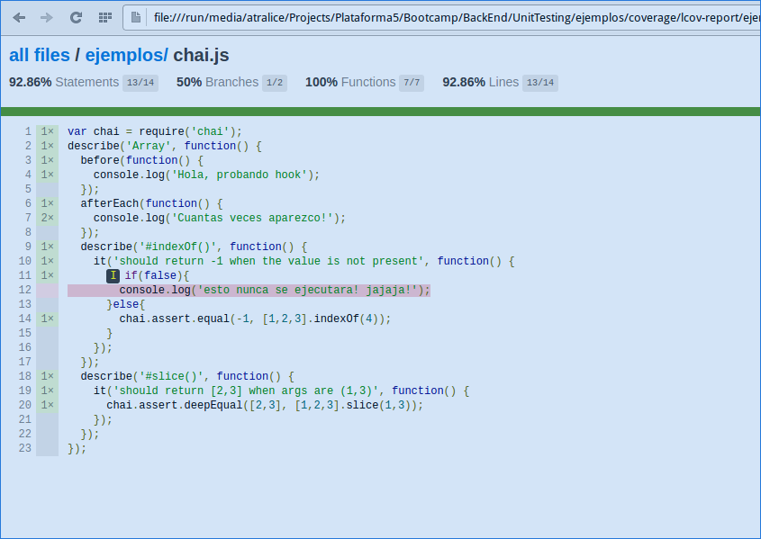

# Software Testing

Cuando pensamos en testing en software, pensamos en algo que nos de garantías de que la aplicación que estamos construyendo funcione bien. Además de que funcionen bien en nuestra compu, nos vamos a asegurar que cuando lo deployemos (veremos esto más adelante), también funcionen en el destino o que si fallan algunos tests directamente no lleguen las nuevas actualizaciones al servidor de producción, por ejemplo.
Tambien podemos hacer del testing una _filosofía de vida_ cómo veremos más abajo, pero en general testear bien nuestra aplicación nos da más que sólo garantías, nos proveen una documentación viva de nuestro código.

## Qué cosas testear? Cuantos tests hacer?

Las respuestas a estas preguntas van a variar según el proyecto que estén haciendo y sus necesidades, pero en general pueden seguir las __guidelines__ seteadas en la siguiente _pirámide_:



En la pirámide vemos los tipos de pruebas y la cantidad de ellas que debemos hacer en nuestra aplicación. En general la mayoría de los tests que hagamos va a ser de tipo __unit tests__, en segundo lugar __Integration Tests__ y por último __End-to_End__. Veremos cada uno de estos tipos de tests en detalle.

## Unit Testing

Un test unitario o _unit test_ es un pedazo de código automático que invoca a una __unidad de trabajo__ del sistema y chequea que el resultado de esa unidad sea el esperado.
Una __unidad de trabajo__ es cualquier función lógica del sistema que no pueda ser separada en piezas más pequeñas y que puede ser invocada por alguna otra interfaz. Esta unidad puede ser sólo un método, o el comportamiento de una clase entera, o el comportamiento de varias clases interactuando entre ellas para lograr un próposito, que puede ser verificado.

La presencia de _tests unitarios_ habla de que el software fue construido (de alguna manera) de forma _modular_. Cuando escuches que alguien dice que _el software debería ser más __testeable___ se refiere a esto.

Un buen test unitario debería ser:

* Completamente automatizable
* Poder ejecutarse en cualquier orden en conjunto con otroso tests.
* __Siempre__ retorna el mismo resultado, no importa cuantas veces lo corra.
* Es rápido
* Testea un solo concepto lógico del sistema
* Es fácil de entender al leerlo
* Es fácil de mantener

> Si cuando estamos escribiendo los tests nos damos cuenta que tenemos que crear muchos [mockups](http://stackoverflow.com/questions/2665812/what-is-mocking), es una señal que nuestro diseño no es muy modular, y que tal vez se puede mejorar. 

### Ventajas

Obviamente, armar todos los tests y correrlos (y pasarlos todos!) nos puede poner un overhead en nuestro proyecto.



Si el proyecto es chico, entonces podemos probar todo a mano y darnos cuenta rápido si un cambio afecta o no a las demás partes de la aplicación, pero a medida que el proyecto va a creciendo, se hace más complicado probar todo manualmente y más time-consuming. En esos casos hacer Units Tests automáticos nos va a brindar los siguientes beneficios:

* Nos va a permitir hacer cambios grandes en el código rápidamente. Cuando los hacemos, corremos los tests de nuevo y vemos rápidamente si todo funciona bien o no. Nos puede salvar varias horas de debugeo.
* Nos da un límite para decidir cuando una funcionalidad está terminada o no. Si pasa el test, entonces pasamos a la siguiente feature.
* Tenés feedback inmediato de tu código, podés ver examente donde está fallando y hasta usar eso para continuar trabajando donde dejaste la última vez.
* Si ya tenés experiencia armando tests, vas a poder codear más rápido, ya que tenés en la cabeza exactamente qué queres lograr antes de empezar a codear.
* Si tenés buenos tests definidos, estás muy cerca de tener una buena documentación, ya que en los tests implicitamente estás diciendo qué debería hacer cada cosa.
* Te va a ayudar a reutilizar tu código en otro proyecto. Cuando empezas un proyecto nuevo, llevá tu código y tus tests, refactorizá el código en el nuevo proyecto hasta que los tests pasen de nuevo! :smile:

## Integration Test

Estos tests prueban el funcionamiento de distintas unidades combinadas, por ejemplo la interacción entre un módulo y sus dependencias. 

## End to End Tests

Estos tests sirven para probar la aplicación en su totalidad, es decir, usarla como si fueras el usuario final y probar si todo está funcionando bien. Por ejemplo, si estuvieramos trabajando en un eCommerce, probariamos si podemos loaguearnos, buscar un producto, agregarlo al carrito, y comprarlo!

## Test Driven Development

Test Driven Development (TDD) es una técnica para construir software que se basa en escribir tests. Básicamente consiste en el siguiente ciclo:



* __Agregá un test nuevo__: En TDD, para cada nueva feature vas a escribir un nuevo test, para hacerlo el desarrollador está obligado a conocer en detalle las especificaciones y requerimientos de esa feature. Esto es clave y es el gran diferenciador entre escribir el _test_ __después__ que hayas escrito el código, de esta forma tenés todo definido antes de empezar por la primera línea de código.
* __Corré todos los test y fijate si el nuevo falla__: Si ya teniamos otros tests, antes de empezar a codear nos fijamos si realmente el nuevo test NO pasa. En caso contrario estariamos implementando funcionalidad que ya está definida o funcionalidad que no sirve, o tal vez el test esté mal escrito.
* __Escribí el código__: Ahora sí, empezamos a escribir código de tal manera que logremos que el test pase. En esta etapa no importa la elegancia del código, sólo queremos pasar el test!
* __Corré los tests__: Si todos los test corren, incluido el nuevo, el desarrollador está seguro que el nuevo código cumple con los requerimientos de la funcionalidad y además que los nuevos cambios no rompen ninguna otra feature ya existente. Si no pasan, hay que volver al punto 4!
* __Refactoreá el código__: Una vez que hayamos pasado el test, vamos a refactorear el código para que sean lo más legibles y performantes posibles, y que mantengan la convención de nombres y patrones que todo el proyecto.
* __Repetí__: Ahora pasamos a un nuevo test, es decir vamos a agregar un nuevo feature o funcionalidad y vamos a empezar desde el primer paso!

Como siempre, existen variaciones sobre este _standart_, de hecho hay dos grandes concepciones, la de codear primero y escribir los test despues, o al reves. Si escribimos los  _units tests_ primero y una vez que terminamos empezamos a codear el nuevo feature  nos aseguramos que entendemos bien el problema antes de empezar a codear la solución. 

## Testing Frameworks

Existen muchas herramientas que nos van a ayudar a automatizar la creación, ejecución y control de los tests unitarios. De hecho, exiten herramientas que sirven como 'ambientes' de prueba, y con ellas vamos a poder armar el workflow de tests (agrupar tests, ejecutar los tests automáticamente antes de hacer un deployment, etc..) y tambien existen librerías de _Aserción_ (assertion), que nos van a servir para comprobar si el output esperado de una función condice con el output real.

> En programación una _aserción_ o _assertion_ es un predicado (expresión que devuelve verdadero o falso), incluido en un programa y que generalmente compara el resultado o el estado esperado de algo contra el real en el momento de ejecución.

Hay muchos tipos de frameworks de pruebas y también librerías de assertion, nosotros vamos a usar `Mocha` como framework y `Chai` como assertion. Hay muchas [opiniones](https://medium.com/javascript-scene/why-i-use-tape-instead-of-mocha-so-should-you-6aa105d8eaf4#.oijsbkjr9) sobre los distinos framework, nosotros elegimos este simplemente porque es el más usado!

## Mocha

Mocha viene con muchas features copadas, en su [website](https://mochajs.org/) listan todas, pero algunas que valen la pena mencionar son:

* Soporta muy bien el código asincrónico, incluido Promesas.
* Podés setear el timeout de una llamada asincrónica.
* Tenés distintos `hooks` como `before`, `after`, `before each`, `after` que nos van a dar la posibilidad de armar/limpiar el ambiante antes y después de cada prueba (si es necesario).
* Podés combinarlo con varias librerías de assertion.

Vamos a intalar `mocha` globalmente con `npm`, para poder usarlo como un comando:

```
npm install --global mocha
```

> Depende del proyecto, nos puede llegar a convenir instalar mocha como una dependencia del mismo. Ya que por ejemplo, si pasa mucho tiempo y `mocha` se actualiza bastante (sin compatibilidad), es muy probable que al actualizar el global, no nos funcionen los tests por problemas de compatibilidad.

Para crear nuestras pruebas vamos a armar uno o varios archivos `.js` que luego vamos a ejecutar con mocha. Dentro de ellos vamos a usar las funciones que nos provee la librería:

```javascript
var assert = require('assert');
describe('Array', function() {
  describe('#indexOf()', function() {
    it('should return -1 when the value is not present', function() {
      assert.equal(-1, [1,2,3].indexOf(4));
    });
  });
  describe('#slice()', function() {
    it('should return [2,3] when args are (1,3)', function() {
      assert.equal([2,3], [1,2,3].slice(1,3));
    });
  });
  describe('#slice()', function() {
    it('should return [2,3] when args are (1,3)', function() {
      assert.deepEqual([2,3], [1,2,3].slice(1,3));
    });
  });
});
```

> Node trae una librería de assertion nativa llamda `assert`, pueden ver su documentación [aquí](https://nodejs.org/api/assert.html).



El de arriba es el output que nos devuelve `mocha`. Nos lo presenta de una forma tal que sea fácil y rápido ver qué pruebas pasaron OK y cúales no.

Primero, vemos que la función `describe` nos sirve tanto para agrupar pruebas como para declarar pruebas unitarias. Estas librerías estan hechas de tal forma que se pueda 'leer' naturalmente lo que está ocurriendo, por ejemplo, para la primera prueba podriamos decir (en inglés): _'Describe: IndexOF it should return -1 when value is not present.'_. 
De esta forma vamos a poder naturalizar el lenguaje de las pruebas, y escribir lo que debería pasar y mocha se encargará de colorear la salida y decirnos si pasó lo que esperabamos u otra cosa.

Ahora dentro de `it()` es donde vamos a ejecutar nuestro código y poner las assertions necesarias para saber si está funcionando bien. En nuestro ejemplo, probamos el código y el assertion en una misma línea:

```
assert.equal(-1, [1,2,3].indexOf(4));
```

Fijensé que cómo `[1,2,3].indexOf(4);` devuelve -1 , y pasamos cómo primer parámetro el -1, entonces la prueba finalizó con éxito (mocha nos pintó con una flechita verde avisandonos esto).

> Si prueban assert.equal en Node, van a ver que si el assertion es correcto retorna undefined, pero si no es correcto lanzá un error. Justamente Mocha captura estos errores y nos lo muestra de una manera bonita.

Ahora, si vemos el output, mocha nos dice que la segunda prueba falló. Si probamos `[1,2,3].slice(1,3)` en Node, vamos a ver que efectivamente nos devuelve `[2,3]` como pusimos en el test. El problema es la comparación de arreglos, como se pueden imaginar, al ser objetos distintos la comparación da siempre falsa. Para poder comparar objetos, se hace lo que se llama una `deep comparison`, es decir controlamos que la estructura y contenido sean iguales y no sólo si los objetos son los mismos. (pueden leer más de esto [aquí](http://stackoverflow.com/questions/13225274/the-difference-between-assert-equal-and-assert-deepequal-in-javascript-testing-w)). Como vemos, al usar `deepEqual` en vez de `equal` el assert no da error, y por lo tanto mocha nos muestra la querida flechita verde!

Vamos a instalar chai en nuestro proyecto: `npm install chai` y vamos a requerirlo en vez de assert. Ahora vamos a usar las funciones  propias de chai (ver [documentación](http://chaijs.com/api/assert/)), que por suerte son parecidas a las nativas de Node:

```javascript
var chai = require('chai');
describe('Array', function() {
  describe('#indexOf()', function() {
    it('should return -1 when the value is not present', function() {
      chai.assert.equal(-1, [1,2,3].indexOf(4));
    });
  });
  describe('#slice()', function() {
    it('should return [2,3] when args are (1,3)', function() {
      chai.assert.deepEqual([2,3], [1,2,3].slice(1,3));
    });
  });
});
```



### Tipos de Assertions de Chai

De hecho, Chai soporta tres _estilos_ de assertions distintos:

* Assert: Es la que vimos en los ejemplos anteriores.
	
	```javascript
	var assert = require('chai').assert;
	assert.typeOf(1, 'number');
	```

* Expect: Este estilo y el siguiente utilizan el `method chaining` para darle una forma de lenguaje natural a las assertions:
	
	```javascript
	var expect = require('chai').expect;
	expect(1).to.be.a('number');
	```

* Should: La diferencia con el anterior es cómo se construye el assertion. Más info [acá](http://chaijs.com/guide/styles/)
	
	```javascript
	var chai = require('chai');
	chai.should();
	1.should.be.a('number');
	```

> Pueden leer la documentacion de Except y Assert [aquí](http://chaijs.com/api/bdd/)

## Hooks

Los hooks nos dan la posibilidad de ejecutar código antes o despueś de todas las pruebas, o inclusive antes o después de cada una.

```javascript
var chai = require('chai');
describe('Array', function() {
  before(function() {
    console.log('Hola, probando hook');
  });
  afterEach(function() {
    console.log('Cuantas veces aparezco!');
  });
  describe('#indexOf()', function() {
    it('should return -1 when the value is not present', function() {
      chai.assert.equal(-1, [1,2,3].indexOf(4));
    });
  });
  describe('#slice()', function() {
    it('should return [2,3] when args are (1,3)', function() {
      chai.assert.deepEqual([2,3], [1,2,3].slice(1,3));
    });
  });
});
```



Como vemos, los hooks son funciones que se ejecutan antes o despues de todas las pruebas del bloque (dentro del primer `describe`), o también antes o después de cada una.  Mocha nos provee los siguientes hooks:

```javascript
describe('hooks', function() {

  before(function() {
    // Corre antes que todas pruebas en el bloque
  });

  after(function() {
    // Corre despues que todas pruebas en el bloque
  });

  beforeEach(function() {
    // Corre antes de cada prueba en el bloque
  });

  afterEach(function() {
    // Corre despues de cada prueba en el bloque
  });

  // test cases
});
```

La idea de los tests unitarios es que sean __idempotentes__ es decir que si los ejecuto varias veces, el resultado/estado de la app sea siempre sea el mismo. Es decir que si, por ejemplo, yo creo un usuario en nuestra app, cuando termine de hacer las pruebas, debería borrarlo, para que el estado de la app no se modifique. Los `hooks` nos van a ser de gran utilidad para poder cumplir con esto.


## Code Coverage

El `Code Coverage` es una métrica usada para saber qué tan bien estás probando tu applicación. Simplemente se basa en medir cuantas líneas de código se ejecutaron en tus tests, es decir que si tenés un code coverage del 100%, significa que no hubo ni una línea de código que no se ejecutó.

> Que tengas 100% de code coverage no quiere decir necesariamente que tu aplicación no puede fallar, simplemente es una métrica que ayuda a tener una idea de lo que probamos.

Para sacar esta métrica de nuestro proyecto vamos a usar una librería llamda `istambul`.

Primero empezemos instalandola: ` npm install --save-dev istanbul`.

Ahora, queremos medir el coverage de nuestros tests (obviamente como es un caso trivial, va a dar 100%!), entonces corremos: `./node_modules/.bin/istanbul cover _mocha chai.js`.

> [Explicación de porqué usamos _mocha en vez de mocha.](https://github.com/gotwarlost/istanbul/issues/44#issuecomment-16093330)

Istanbul nos va generar un reporte con el code coverage dentro de la carpeta `coverage`. Lo genera en varios formatos, el más lindo es en HTML asi que vamos a ver ese:

[Istanbul](./img/istambul.png)

Como vemos, el code coverage nos da 100%! eso es porque se ejecutaron todas las lineas de código.

Ahora agregemos un if en el código de algún test de tal forma que ese branch nunca se ejecute:

```javascript
 describe('#indexOf()', function() {
    it('should return -1 when the value is not present', function() {
      if(false){
        console.log('esto nunca se ejecutara! jajaja!');
      }else{
        chai.assert.equal(-1, [1,2,3].indexOf(4));
      }
    });
  });
```

Ahora, si volvemos a correr istanbul, vamos a ver que el `coverage` no nos da 100%!



Si vamos al reporte HTML, vamos a ver que nos indica que estamos cubriendo la mitad de las `branches` e inclusive nos colorea la parte que jamás se ejecuto.



Esto nos va a servir mucho para saber qué partes de nuestro código hemos 'testeado'. Fijensé que puede ocurrir que una aplicación tenga pedazos de código que jamás se ejecuten y lo mismo anda perfecto. O puede pasar que tengamos 100% de `code coverage` pero que la apliación falle igual. Es decir, esta no es la única métrica que tenemos que mirar para decidir si nuestra aplicación está bien testeada o no.
